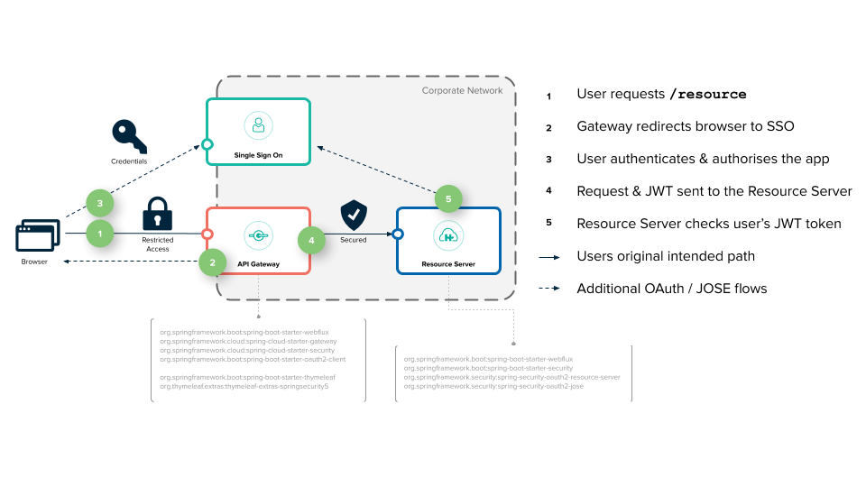

# example-spring-cloud-gateway

## 基础网关服务

### 服务应用信息

| 服务名   | 类型                   | 端口 | 说明     |
| -------- | ---------------------- | ---- | -------- |
| gateway  | oauth2-client          | 8080 |          |
| resource | oauth2-resource-server | 9000 | 实际接口 |


### 配置

- 去除路径前缀

```java
class RouteLocatorConfig {
    public RouteLocator customRouteLocator(RouteLocatorBuilder builder) {
        // 路径路由，去除前缀
        // http://localhost/get/users/toquery -> https://api.github.com/users/toquery
        // http://localhost/rewrite/get -> http://httpbin.org:80/get
        builder.routes().route("path_rewrite_route", r -> r.path("/rewrite/**")
                .filters(f -> f.rewritePath("/rewrite/(?<path>.*)", "/${path}"))
                .uri(uri)
        ).build();
    }
}
```


- 添加接口的权重和负载均衡

```yaml
spring:
  application:
    name: cloud-gateway
  cloud:
    gateway:
      routes:
      - id: service1_prod
        uri: http://localhost:8081
        predicates:
        - Path=/test
        - Weight=service1, 50
      - id: service1_canary
        uri: http://localhost:8082
        predicates:
        - Path=/test
        - Weight=service1, 50
```


## 基于 Oauth2 的 SSO 认证授权网关

Spring 官方原文：[https://spring.io/blog/2019/08/16/securing-services-with-spring-cloud-gateway](https://spring.io/blog/2019/08/16/securing-services-with-spring-cloud-gateway)



### Oauth2 角色说明

- server
- client


### 服务与端口

| 服务名       | 类型                   | 端口 | 说明     |
| ------------ | ---------------------- | ---- | -------- |
| uaa          | oauth2-server          | 8090 |          |
| sso-gateway  | oauth2-client          | 8080 |          |
| sso-resource | oauth2-resource-server | 9000 | 资源服务 |


### 快速使用

```bash
./build-images.sh
docker-compose up
```

In an INCOGNITO or PRIVATE browser window...

[http://localhost:8080/resource](http://localhost:8080/resource)

You'll be asked to login, use Username: `user1` and Password: `password`.

> These credentials are configured in the `[sso/uaa/uaa.yml](sso/uaa/uaa.yml)` file.

You'll be asked to Authorise that the resource-server is allowed to read your profile and check your scopes. 
Click "Authorise` to allow this. You'll then be redirected to your original destination and the resource server 
will print out your Subject's identity GUID.

> Resource was accessed by a584b8b8-eaf2-4280-b9c3-12f65cf8524b (sub)


### Cleaning Up

When you're done use `Ctrl-C` to stop the containers, `docker-compose down` to remove leftovers. `docker-compose rm -f`

### Want to go again? 

Probably have to clear your cookies and restart the Docker bits... 

